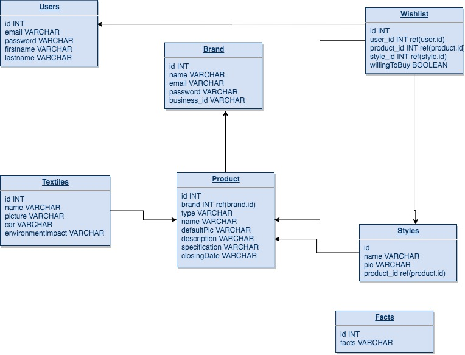
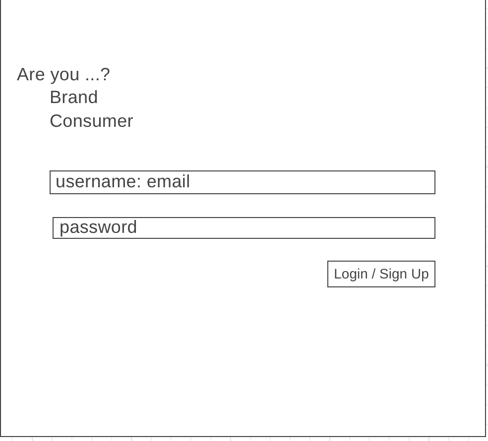
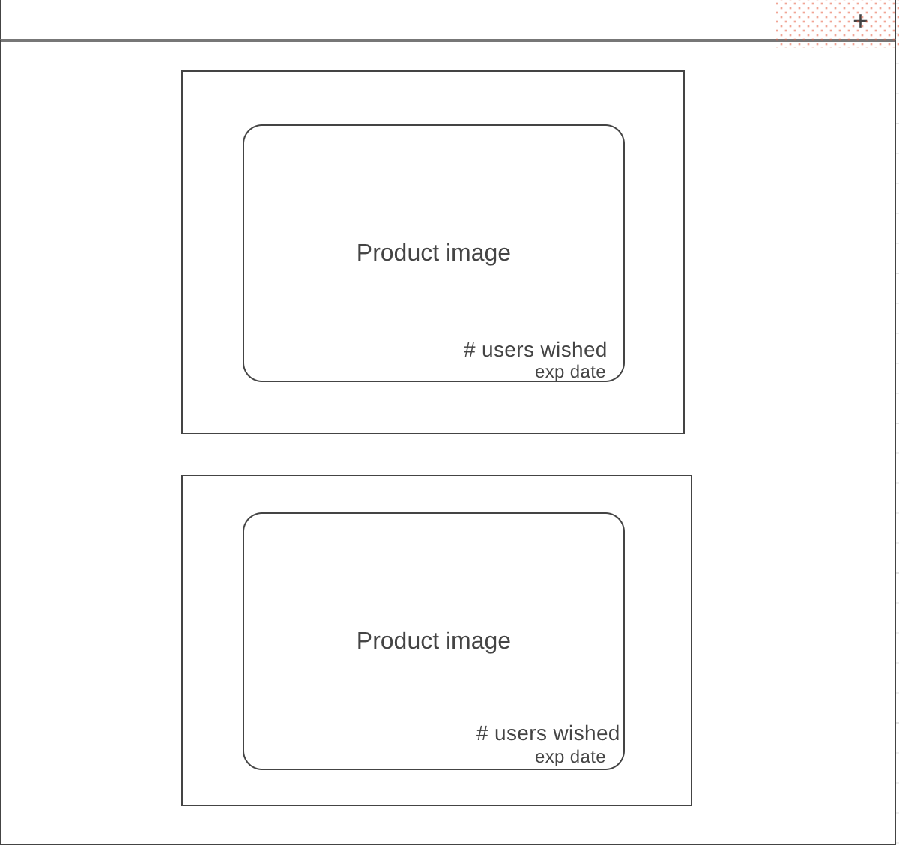

# Fashion-Sustainability

# Problem: 
Around 30 percent of all clothes made around the world are never sold, according to the Australian Circular Textile Association (ACTA) and the cost of this inventory distortion is estimated by IHL Group in 210 billion US dollars.

# Solution: 
An app that allows brands to share their designs and styles pre-season so that consumers can vote on the styles they're most likely to buy in order to prevent over-production of garments, therefore eliminating waste. App will also be used to educate consumers on how to care for their garments in an attempt to extend their lifecycle, as well as educating consumers on the environmental effects of different textiles.

## Database Structure

- **Users**
  - id
  - email (username) - _Unique_
  - password
  - firstname
  - lastname

- **Brands**
  - id
  - email (username) - _Unique_
  - password
  - name
  - businessID
  
- **Products**
  - id
  - brand_id - _References Brands_
  - type 
  - name 
  - defaultPic
  - description 
  - specifications
  - closingDate
  - textile_id - _References Textiles_ (ARR)

- **Styles**
  - id
  - name
  - pic
  - product_id - _References Products_

- **Textiles**
  - id
  - name
  - pic
  - care 
  - environmentalImpact (how to recycle, amount of water used)

- **Wishlist**
  - id
  - willing to buy (boolean)
  - user_id - _References Users_
  - product_id - _References Products_
  - style_id - _References Styles_

- **Facts (only if there isn't an API)**
  - id
  - fact

## API Endpoints
- **Users**

  | Method | Endpoint     | Description           | Body Data                |
  | ------ | ------------ | --------------------- | ------------------------ |
  | GET    | `/users/isUserLoggedin`     | Get logged in user        | n/a                      |
  | GET    | `/users/logout` | Log out user | n/a                      |
  | POST   | `/users/signup`    | Add new user          | `email (username)`, `password`, `firstname`, `lastname` |
  | POST   | `/users/login`    | Log in user        | `email (username)`, `password` |

- **Brands**

  | Method | Endpoint  | Description    | Body Data    |
  | ------ | --------- | -------------- | ------------ |
  | GET    | `/brands/isBrandLoggedIn` | Get logged in brand | n/a          |
  | GET    | `/brands/all` | Get list of all brands | n/a          |
  | GET    | `/brands/logout` | Log out brand | n/a | 
  | POST    | `/brands/signup` | Add new brand | `email (username)`, `password`, `name`, `businessId`        |
  | POST   | `/brands/login` | Log in brand | `email (username)`, `password` |

- **Products**

  | Method | Endpoint                 | Description                         | Body Data                                 |
  | ------ | ------------------------ | ----------------------------------- | ----------------------------------------- |
  | GET    | `/products/:brand_id/all`                 | Get all products for a brand                       | n/a                                       |
  | POST    | `/products/:brand_id/add`             | Add a new product              |       `brand_id`, `type`, `name`, `default_pic`, `description`, `specifications`, `closing_date`                                |
  | GET    | `/products/:type` | Get products by type| n/a                                       |
  | GET    | `/products/:material`   | Get products by material  | n/a                                       |

- **Styles**

  | Method | Endpoint                  | Description                           | Body Data                            |
  | ------ | ------------------------- | ------------------------------------- | ------------------------------------ |
  | GET    | `/styles/:product_id` | Get styles by product id | n/a                                  |
  | POST   | `/styles/add`               | Add new style                      | `name`, `pic`, `product_id` |

- **Textiles**

  | Method | Endpoint                  | Description                           | Body Data                            |
  | ------ | ------------------------- | ------------------------------------- | ------------------------------------ |
  | GET    | `/material/all` | Get all materials | n/a                                  |

- **Wishlist**

  | Method | Endpoint                  | Description                           | Body Data                            |
  | ------ | ------------------------- | ------------------------------------- | ------------------------------------ |
  | GET    | `/wishlist/:user_id` | Get all wishlist items by user id | n/a                                  |
  | POST   | `/wishlist/:product_id/add`               | Add new product to users wishlist                      | `product_id`, `user_id`, `style_id` |
  | DELETE   | `/wishlist/:wish_id/delete`               | Delete product from user wishlist                      | n/a |
  | PATCH  | `/wishlist/:wish_id/vote`               | Add willing to buy                      | `wish_id`, `true` |

- **Facts**

  | Method | Endpoint                  | Description                           | Body Data                            |
  | ------ | ------------------------- | ------------------------------------- | ------------------------------------ |
  | GET    | `/facts/:id` | Get fact by id | n/a                                  |

## Frontend

### Routes
| Route                         | Feature                                                                                                                                                                                                                                                                                                    |
| ----------------------------- | ---------------------------------------------------------------------------------------------------------------------------------------------------------------------------------------------------------------------------------------------------------------------------------------------------------- |
| **`/`**                       | Login/Signup page. Displays fun fact about sustainability or waste in the fashion industry.                                                                                                                                                                                                 |
| **`/brand/:brandId/dashboard`**                  | Shows list of all designs a brand has uploaded. Displays number of votes on each design and style.                                                                                                                                                               |
| **`/brand/:brandId/add`**              | Shows a form where the logged in brand can add a new product. Submits new product to Database. These changes are reflected app wide.                                                                                                       
| **`/consumer/:userId/setUp`**      | Shows a form where the logged in user can add brand, type of clothing, or styles preferences. Saves preferences to the Database. These changes are reflected app wide.                                                           
| **`/consumer/:userId/dashboard`**                  | Shows list product cards one at a time. Filter drop down menu will be at the top, where users will be able to filter their results based on brand or type of clothing.  |
| **`/consumer/:userId/wishlist`**      | Shows list of all the products that a user has added to their wishlist. On this page users will be able to add if they would buy a product.                                                                 |                                              |
| **`/about`**                  | Shows short description of what this app is about and who made it                                                                                                                                                                                                                                          |

### Wireframes 

