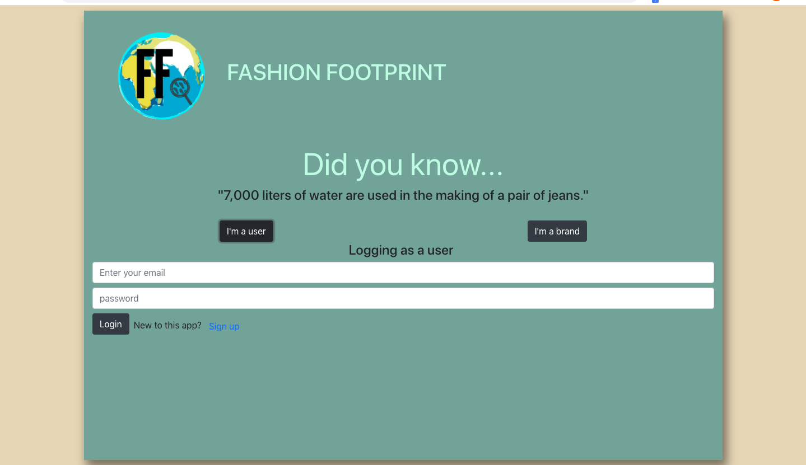
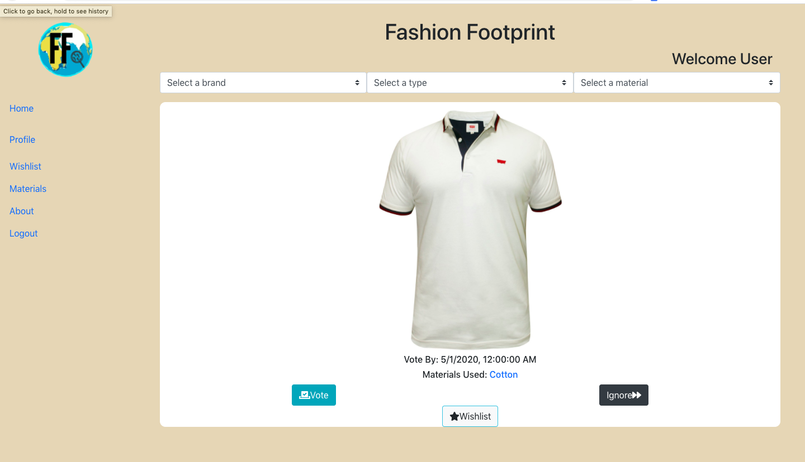
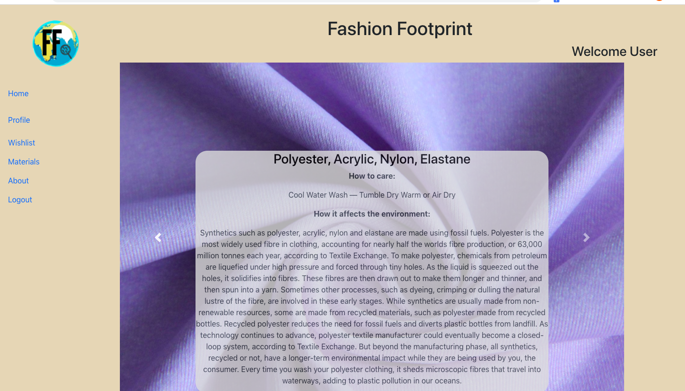

# Fashion-Sustainability

## Live @ https://fashion-fprint.herokuapp.com/

# Problem: 
Around 30 percent of all clothes made around the world are never sold, according to the Australian Circular Textile Association (ACTA) and the cost of this inventory distortion is estimated by IHL Group in 210 billion US dollars.

# Solution: 
An app that allows brands to share their designs and styles pre-season so that consumers can vote on the styles they're most likely to buy in order to prevent over-production of garments, therefore eliminating waste. App will also be used to educate consumers on how to care for their garments in an attempt to extend their lifecycle, as well as educating consumers on the environmental effects of different textiles.

Built with React.js, Node.js with Express, PostgreSQL, and Bootstrap.

## Features

Users are able to:

* Sign up for an account.
* View products and vote on them or skip them.
* Add products to wish list.
* View a random fact about sustainability in the fashion industry on the home page.

## Technologies Used

* React.js. For the front-end/client interface of our app.
* CSS3 & Bootstrap. For the styling of our app.
* Node.js & Express.js. For the HTTP backend server.
* PostgreSQL. As our relation database management system.
* Passport.js. For handling user authentication and authorization.
* pg-promise. For interfacing with our database in our backend code.
* bcrypt. For hashing and salting passwords before storage.

## Technical milestones 

* Using SQL queries to filter products on the frontend. 
* Using a table to keep track of users wishlist items.
* Integrating user authentication with Passport.js, securely storing passwords and allowing for cookie-based authorization.

##  Local Setup

You must have installed Node.js and PostgreSQL in your computer.

You can check for these dependencies with node -v and psql -v. If your shell/terminal doesn't complain and you see version numbers you are good to go.

1. Clone this repo: 
  
   git clone https://github.com/tbriany/Fashion-Sustainability.git

2. Install dependencies for the Node/Express Server (backend folder):

   cd server && npm install

3. Install dependencies the React App (frontend folder):

   cd client && npm install

4. Create database and seed sample data while being in the server directory with:
 
   psql -f ./backend/database/seed.sql
   Make sure PostgreSQL is running!

5. To launch the Node/Express server, inside the backend folder run:
 
   npm run start:dev
 
6. To launch the React App, inside the frontend folder, and preferably in another terminal window run:
 
   npm start
 
A new browser tab should have been opened and the App should be running. If that is not the case check the terminals output for errors, if you are unable to troubleshoot the problem, I would be happy to address issues so open one

[Wireframes](./assets/wireframes.md)